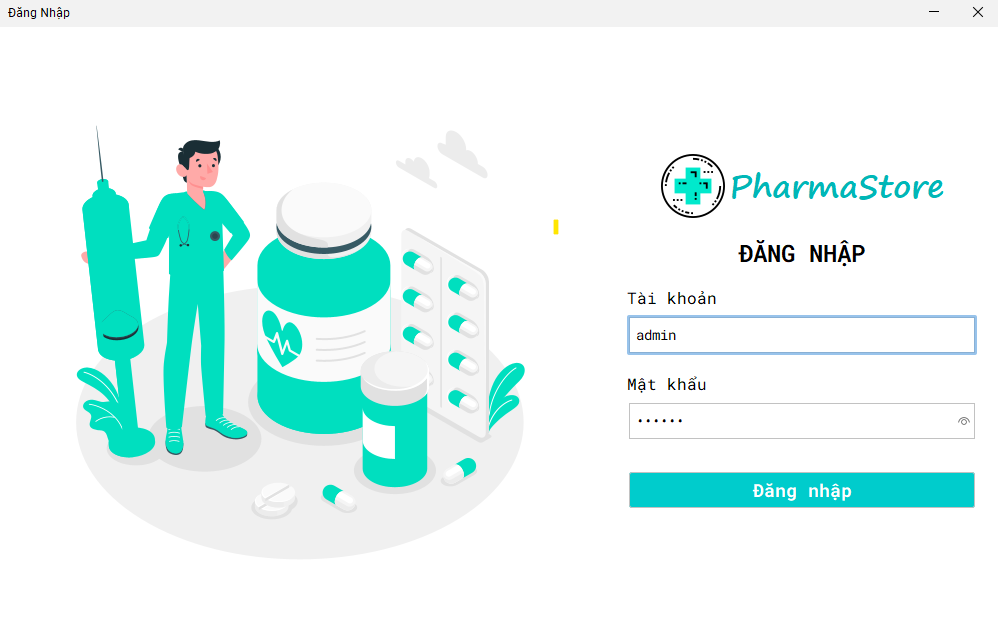
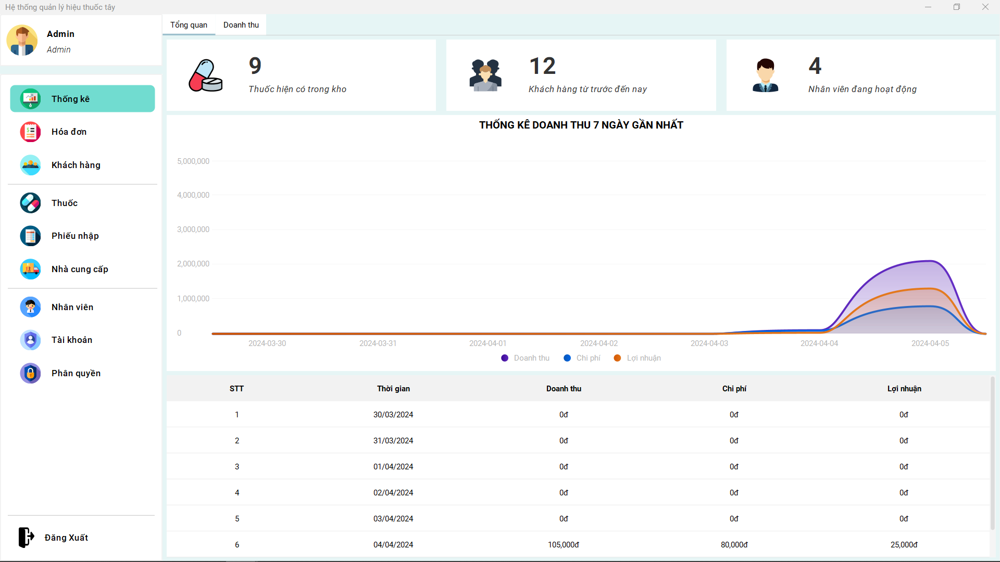
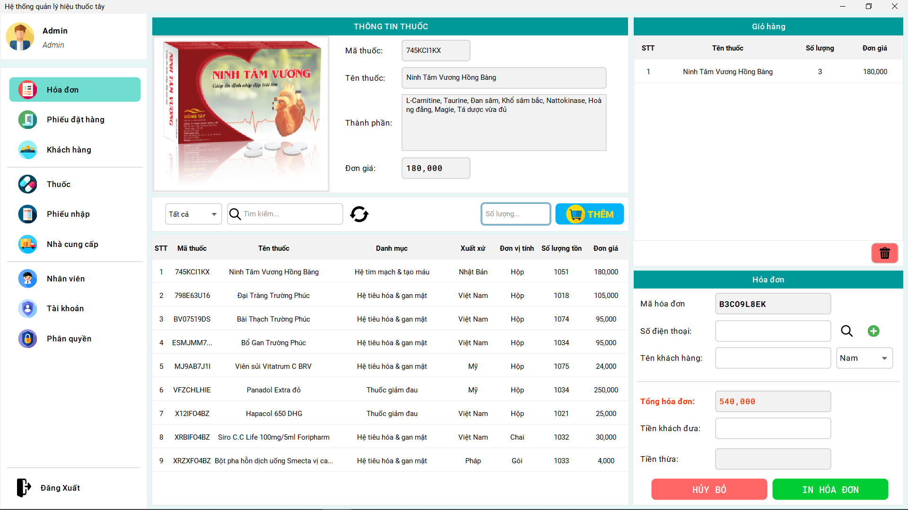
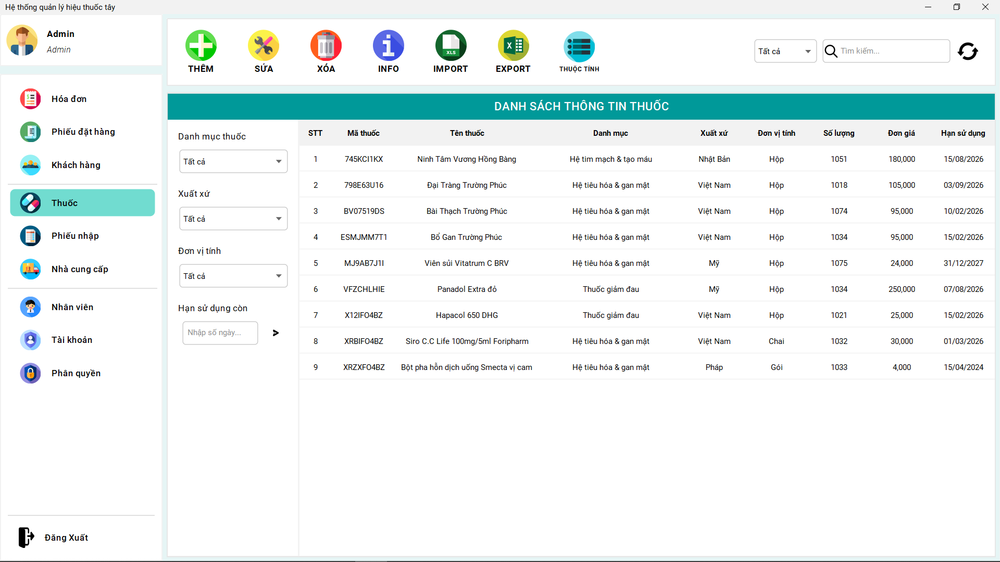
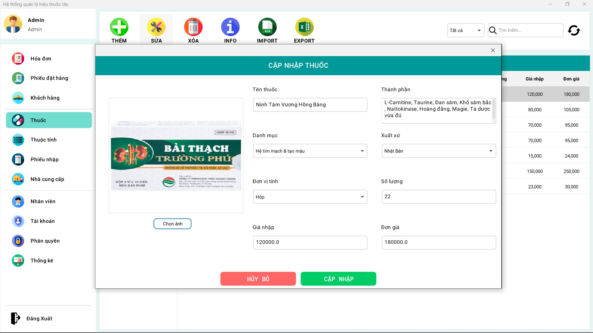
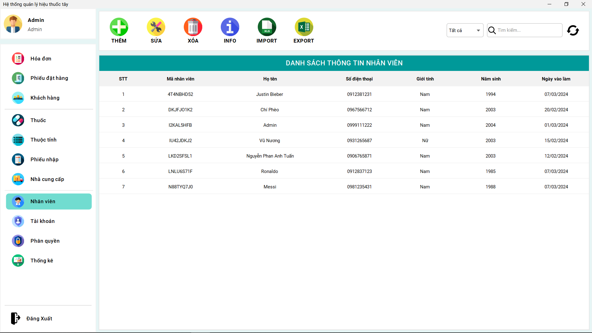
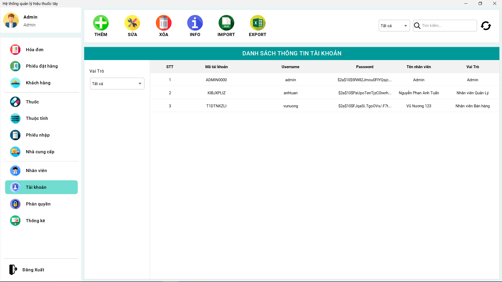

#HUST - Đại học Bách Khoa Hà Nội

## Môn: Kỹ thuật phần mềm
## Đề tài: **Quản lý Hiệu Thuốc**

>
## Technology
- Java
- SQL Server
- NetBeans 17

## Giao diện 

<h3 align="center">Đăng nhập</h3>

<h3 align="center">Thống kê</h3>

<h3 align="center">Hóa đơn</h3>

<h3 align="center">Quản lý thuốc</h3>

<h3 align="center">Cập nhập thuốc</h3>

<h3 align="center">Quản lý nhân viên</h3>

<h3 align="center">Quản lý tài khoản</h3>

